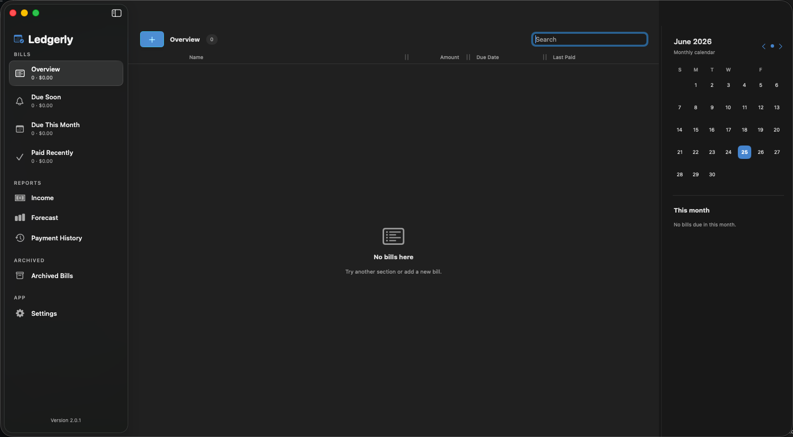

# Ledgerly

Ledgerly is a private, native bill organizer for macOS. It keeps bills, income,
payment history, receipts, reminders, and forecasts together without requiring
an account or bank connection.



## Features

- Overview for upcoming, overdue, paid, and archived bills
- Weekly, biweekly, monthly, quarterly, yearly, and one-time schedules
- Local notification reminders and configurable Due Soon badges
- Payment history with confirmation numbers and attachments
- Twelve-month bill forecast and monthly set-aside suggestions
- Income tracking with a monthly after-bills summary
- Automatic-payment logging for eligible bills
- Local password protection backed by macOS Keychain
- Liquid Glass interface on macOS 26 with adaptive material fallbacks
- Local JSON storage with no analytics, cloud account, or bank connection

## Requirements

- Apple silicon Mac
- macOS 13 or later

## Install

1. Download `Ledgerly-3.0.0.dmg` from the
   [latest GitHub Release](https://github.com/YodaGuru/Ledgerly/releases/latest).
2. Open the disk image.
3. Drag Ledgerly into Applications.

Ledgerly 3.0.0 is currently ad-hoc signed and not Apple-notarized. macOS may
show a Gatekeeper warning when opening a downloaded build.

## Privacy

Ledgerly stores its data locally in:

```text
~/Library/Application Support/Ledgerly
```
The location can be changed in Settings.

The app does not connect to a bank, require an online account, collect
analytics, or send financial data to a server. Password protection stores the
password in macOS Keychain.

## Build from source

Building requires the current Xcode command-line tools, including Icon Composer.

```sh
chmod +x build.sh
./build.sh
```

The script creates the app and `Ledgerly-3.0.0.dmg`. It targets Apple silicon
and macOS 13 or later.

## Support and security

Use GitHub Issues for ordinary bugs and feature requests. Please report
security-sensitive problems privately according to [SECURITY.md](SECURITY.md).

## License

Ledgerly is free software licensed under the GNU General Public License v3.0
or later. See [LICENSE](LICENSE).
